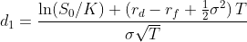
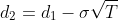
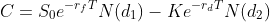
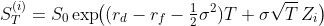
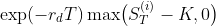
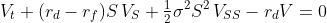
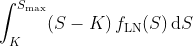

# Explanation & Notes

## Black–Scholes

   
   
  

---

## Monte Carlo Simulation

   
  

---

## PDE (Crank–Nicolson)

  

on \([0,S_{\max}]\times[0,T]\) with  
- **Terminal**: \(V(S,T)=\max(S-K,0)\)  
- **Boundaries**: \(V(0,t)=0\),  
  \(V(S_{\max},t)=S_{\max}-K\,e^{-r_d(T-t)}\)

---

## Quadrature (Simpson’s Rule)

  

via composite Simpson’s rule, where \(f_{\mathrm{LN}}\) is the risk-neutral lognormal density.  
